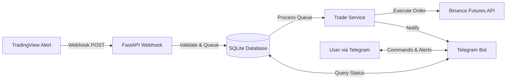

# 🚀 TradingView Webhook Bot for Binance

[](https://www.python.org)
[](https://fastapi.tiangolo.com)
[](https://www.docker.com)
[](https://www.sqlalchemy.org)
[](https://opensource.org/licenses/MIT)
[](https://github.com/psf/black)

A high-performance, self-hosted trading bot that connects **TradingView** alerts to **Binance Futures** via Webhooks. Built for speed, reliability, and security using modern technologies.

---

## 🌟 Features

*   **⚡ Ultra-Low Latency:** Built with **FastAPI** and **Uvicorn** for millisecond-level order execution.
*   **� Containerized:** Full **Docker** support for one-command deployment.
*   **�️ Secure:** Robust security practices with environment-based configuration (`.env`) and webhook signature validation.
*   **� Database Driven:** Uses **SQLite** and **SQLAlchemy** for reliable data persistence (Logs, Orders, Alerts).
*   **� Telegram Integration:** Full control via Telegram. Start/stop the bot, check balance, correct position, and view logs remotely.
*   **� Advanced Trading:** Supports **Long/Short** directions, dynamic leverage, and percentage-based sizing.
*   **🔄 Auto-Recovery:** Deployment with `docker-compose` ensures the service automatically restarts on failure.

---

## 🏗️ Architecture



---

## 🚀 Getting Started

### Prerequisites

*   A server (VPS) with **Docker** and **Docker Compose** installed.
*   A **Binance Futures** account with API keys (Enable Futures trading).
*   A **Telegram Bot Token** (from [@BotFather](https://t.me/BotFather)) and your **User ID** (from [@userinfobot](https://t.me/userinfobot)).
*   A **TradingView** account (Pro/Premium recommended for Webhooks).

### � Installation (Docker) - Recommended

1.  **Clone the Repository**
    ```bash
    git clone https://github.com/beydah/TradingView-Webhook-Bot.git
    cd TradingView-Webhook-Bot
    ```

2.  **Configure Environment**
    Copy the example configuration and edit it with your credentials:
    ```bash
    cp .env.example .env
    nano .env
    ```
    
    > **Security Note:** Never commit your `.env` file to version control. It contains sensitive API keys.

3.  **Run with Docker Compose**
    ```bash
    docker-compose up -d --build
    ```

    The bot is now running on port `80` (or whichever port you defined in `.env`).

### 🐍 Installation (Manual)

1.  **Install Python 3.10+** and `pip`.
2.  **Install Dependencies**:
    ```bash
    pip install -r requirements.txt
    ```
3.  **Run the Application**:
    ```bash
    python main.py
    ```

---

## ⚙️ Configuration

Your `.env` file controls the bot's behavior. Here are the key settings:

| Variable             | Description                       | Example              |
| :------------------- | :-------------------------------- | :------------------- |
| `BINANCE_API_KEY`    | Your Binance API Key              | `vmPUZE6mv...`       |
| `BINANCE_SECRET_KEY` | Your Binance Secret Key           | `NhqPtmdSJ...`       |
| `TELEGRAM_BOT_TOKEN` | Token from BotFather              | `123456:ABC-DEF...`  |
| `TELEGRAM_USER_ID`   | Your numeric Telegram ID          | `123456789`          |
| `ALERT_KEY`          | Secret key for Webhook validation | `my_secret_password` |
| `WEBHOOK_PORT`       | Port to listen on (Internal)      | `80`                 |

---

## 🔗 TradingView Setup

1.  Create an Alert on TradingView.
2.  In the **Webhook URL** field, enter:
    ```
    http://YOUR_SERVER_IP/webhook
    ```
3.  In the **Message** field, use the following **JSON** format:

    **Open Long:**
    ```json
    {
      "symbol": "BTCUSDT",
      "alert": "long_open",
      "price": {{close}},
      "key": "YOUR_ALERT_KEY"
    }
    ```

    **Close Long:**
    ```json
    {
      "symbol": "BTCUSDT",
      "alert": "long_close",
      "price": {{close}},
      "key": "YOUR_ALERT_KEY"
    }
    ```
    *(Replace `YOUR_ALERT_KEY` with the `ALERT_KEY` defined in your `.env` file)*

---

## 📱 Telegram Commands

Interact with your bot directly from Telegram:

*   `/start` - Initialize the bot.
*   `/help` - Show available commands.
*   `/getpos` - Show current open positions on Binance.
*   `/getwallet` - Show current wallet balance and exposure.
*   `/getalert` - Show the last 20 received alerts.
*   `/getlog` - Download the latest system logs as a text file.

---

## 🧪 Development & Testing

We use `unittest` for testing.

**Run all tests:**
```bash
python -m unittest discover tests
```

**Project Structure:**
```
.
├── app/
│   ├── api/            # API Routers (FastAPI)
│   ├── core/           # Config, DB, Logging
│   ├── models/         # SQLAlchemy Models
│   └── services/       # Business Logic (Binance, Trade, Telegram)
├── data/               # SQLite DB Storage
├── tests/              # Unit Tests
├── main.py             # Entry Point
└── Dockerfile          # Container Definition
```

---

## ❓ FAQ

**Q: Does this work on Binance Spot?**
A: No, this bot is specifically designed for **Binance Futures**.

**Q: Can I run multiple bots?**
A: Yes, but you should run them in separate containers or change the `WEBHOOK_PORT` to avoid conflicts.

**Q: My logs show "Invalid API Key"?**
A: Ensure your `ALERT_KEY` in the TradingView JSON message matches the `ALERT_KEY` in your `.env` file.

---

## 🤝 Contributing

Contributions are welcome! Please read [CONTRIBUTING.md](CONTRIBUTING.md) for details on our code of conduct, and the process for submitting pull requests.

## 📄 License

This project is licensed under the MIT License - see the [LICENSE](LICENSE) file for details.

---

**Disclaimer:** Trading cryptocurrencies involves significant risk. The authors of this software are not responsible for any financial losses incurred while using this bot. Use at your own risk.
